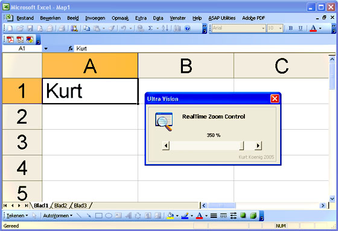



## Excel VBA Zoomer

### Description

This is a small VBA project with a UserForm in it with a slider to zoom your Excel worksheets in or out in real time. The zoomlevel can be between 10% and 400% just like in Excel. It's the real time zoom effect that makes this one nice.
 
### More Info
 

             |
---                |---
**Submitted On**   |2005-08-18 00:32:08
**By**             |[Kurt Koenig](https://github.com/Planet-Source-Code/PSCIndex/blob/master/ByAuthor/kurt-koenig.md)
**Level**          |Intermediate
**User Rating**    |4.7 (14 globes from 3 users)
**Compatibility**  |VBA MS Excel
**Category**       |[Microsoft Office Apps/VBA](https://github.com/Planet-Source-Code/PSCIndex/blob/master/ByCategory/microsoft-office-apps-vba__1-42.md)
**World**          |[Visual Basic](https://github.com/Planet-Source-Code/PSCIndex/blob/master/ByWorld/visual-basic.md)
**Archive File**   |[Excel\_VBA\_1924708172005\.zip](https://github.com/Planet-Source-Code/kurt-koenig-excel-vba-zoomer__1-62217/archive/master.zip)

